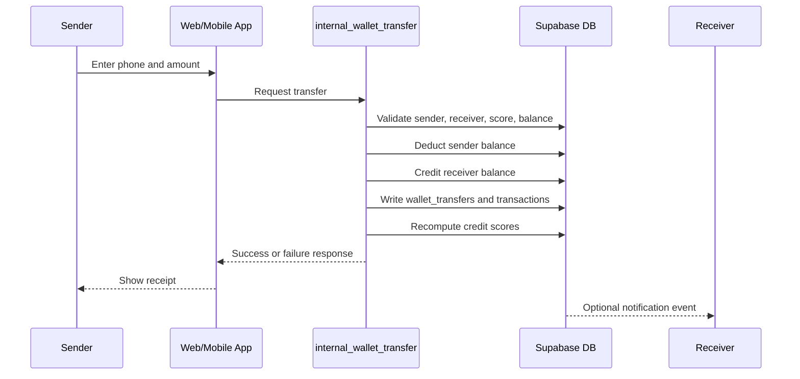
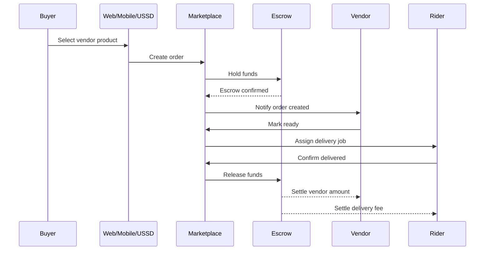
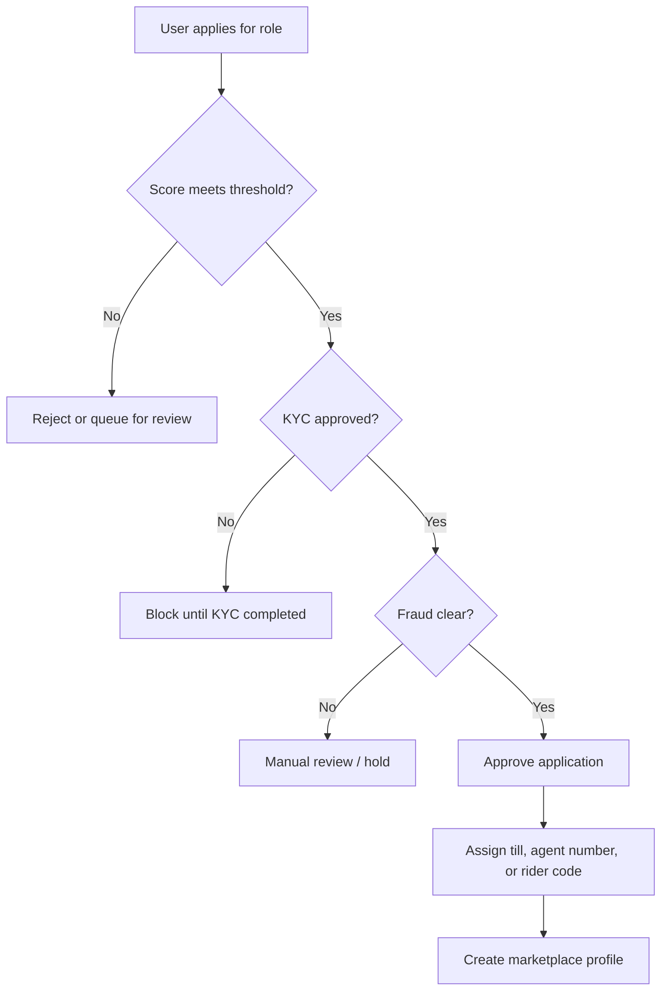
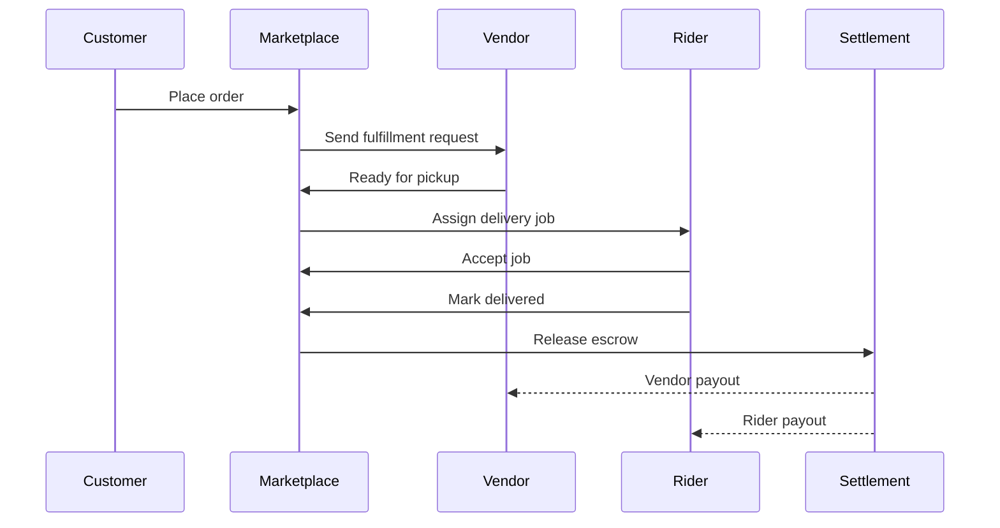

# Ratibu Marketplace, Wallet, and Credit Architecture Spec

## 1. Purpose

This spec defines the Ratibu ecosystem for:

- internal wallet transfers
- credit score and tiering
- vendor accounts and till numbers
- agent onboarding and commissions
- rider delivery jobs and payout
- marketplace product catalog and e-commerce
- rewards and penalties automation
- escrow and settlement
- risk and fraud controls

The design must work consistently across:

- web
- mobile
- USSD
- backend jobs and admin review flows

## 2. Core Principles

1. Ratibu wallet is the internal source of truth for member-to-member transfers.
2. Credit score unlocks roles and limits, but does not replace KYC or fraud checks.
3. Chama membership and marketplace roles are related, but separate concerns.
4. Web and mobile must use the same rules, the same score thresholds, and the same API contracts.
5. External rails such as KCB, M-Pesa, or bank settlement are only used when money leaves or enters Ratibu.
6. Escrow must be used for marketplace transactions that need delivery or approval.
7. Every financial action must be auditable.

## 3. Product Surfaces

### Web

- Public marketing pages
- Dashboard
- Products page
- Marketplace page
- Admin review pages

### Mobile

- Dashboard
- Products screen
- Marketplace screen
- Accounts, savings, loans, and KCB flows
- Delivery and role onboarding flows in later phases

### USSD

- Main menu
- Wallet and contribution flows
- Marketplace summary and basic transfer options
- Short score and role eligibility responses

## 4. Domain Model

### Existing core tables

| Table | Purpose | Notes |
| --- | --- | --- |
| `users` | Main member profile | Stores phone, KYC, system role, wallet balance, credit score, and tier |
| `chamas` | Group entity | Existing chama record |
| `chama_members` | Chama membership | Stores chama role such as admin, treasurer, secretary, member |
| `transactions` | Financial event log | Used for deposits, withdrawals, transfers, and bill actions |
| `gamification_stats` | Rewards and penalties source | Stores points, referral points, penalty points, and contribution stats |
| `penalty_events` | Penalty audit log | Stores penalty details and deductions |
| `user_savings_targets` | Savings goals | Used by the savings and deposit flows |
| `loans` | Loan records | Used for credit and repayment visibility |

### New marketplace and wallet tables

| Table | Purpose | Key fields |
| --- | --- | --- |
| `wallet_transfers` | Internal Ratibu-to-Ratibu transfers | `sender_user_id`, `receiver_user_id`, `amount`, `note`, `channel`, `status`, balances after transfer |
| `marketplace_role_applications` | Vendor, agent, rider applications | `user_id`, `role_type`, `status`, `business_name`, `display_name`, `service_category`, `score_snapshot`, `required_score` |
| `marketplace_profiles` | Approved vendor, agent, rider profiles | `user_id`, `role_type`, `till_number`, `agent_number`, `rider_code`, `delivery_zone`, `is_active` |
| `reward_events` | Reward audit log | `user_id`, `event_type`, `points_added`, `metadata` |
| `penalty_events` | Penalty audit log | `user_id`, `event_type`, `points_penalty`, `monetary_penalty`, `metadata` |
| `credit_score_events` | Score recalculation history | `user_id`, `previous_score`, `new_score`, `reason` |
| `vendor_products` | Vendor catalog | `vendor_user_id`, `title`, `price`, `stock`, `is_active` |
| `marketplace_orders` | Customer orders | `buyer_user_id`, `vendor_user_id`, `status`, `total_amount`, `escrow_status` |
| `marketplace_order_items` | Line items | `order_id`, `product_id`, `quantity`, `unit_price` |
| `delivery_jobs` | Rider jobs | `order_id`, `rider_user_id`, `status`, `delivery_fee`, `route_data` |
| `commission_ledger` | Agent and rider commissions | `user_id`, `source_type`, `source_id`, `amount`, `status` |
| `escrow_accounts` | Funds held until completion | `owner_type`, `owner_id`, `balance`, `status` |
| `escrow_ledger` | Escrow movement log | `escrow_account_id`, `event_type`, `amount`, `reference_id` |
| `settlement_batches` | Bulk settlement tracking | `batch_type`, `status`, `amount_total`, `processed_at` |
| `fraud_flags` | Risk and abuse markers | `user_id`, `flag_type`, `severity`, `status`, `metadata` |

### Suggested enums

| Enum | Values |
| --- | --- |
| `marketplace_role_type_enum` | `vendor`, `agent`, `rider` |
| `marketplace_application_status_enum` | `pending`, `approved`, `rejected` |
| `marketplace_tier_enum` | `starter`, `trusted`, `partner`, `premium`, `elite` |
| `escrow_status_enum` | `held`, `released`, `refunded`, `disputed` |
| `delivery_status_enum` | `queued`, `accepted`, `picked_up`, `delivered`, `failed` |

## 5. Role Rules

### Chama roles

These already exist in `chama_members.role`:

- `admin`
- `treasurer`
- `secretary`
- `member`

These roles affect trust and score, but they do not automatically unlock marketplace roles.

### Marketplace roles

| Role | Minimum score | Core requirement | Result |
| --- | --- | --- | --- |
| `vendor` | `600+` | KYC approved, no active fraud flag | Can receive a till number and sell goods/services |
| `rider` | `650+` | KYC approved, no active fraud flag | Can receive delivery jobs and rider payouts |
| `agent` | `700+` | KYC approved, manual or admin approval preferred | Can receive an agent number and manage collections/support |

### Additional eligibility checks

- active account
- verified phone number
- no blocking fraud flag
- no unresolved compliance hold
- no negative settlement debt beyond tolerance

### Approval rules

- Auto-approve can be enabled only for low-risk roles and trusted users.
- Vendor approval should allow till number assignment.
- Agent approval should allow agent number assignment and commission settings.
- Rider approval should allow delivery job assignment and payout accounts.

## 6. Credit Score Formula

### Score range

- Minimum: `0`
- Maximum: `1000`
- Starting score: `500`

### v1 formula

```text
score =
  clamp(
    0,
    1000,
    500
    + round(points / 25)
    + round(referral_points / 40)
    + round(total_contributions * 8)
    + round(active_admin_roles * 20)
    + round(active_treasurer_roles * 15)
    + round(active_secretary_roles * 10)
    + round(completed_internal_transfers * 3)
    + round(days_since_signup / 30) * 2
    - round(penalty_points / 20)
    - fraud_flag_penalty
  )
```

### Suggested fraud penalty

- low severity flag: `-20`
- medium severity flag: `-50`
- high severity flag: `-100`
- hard compliance lock: block role approval completely

### Tier mapping

| Tier | Score band |
| --- | --- |
| `starter` | `0-599` |
| `trusted` | `600-699` |
| `partner` | `700-799` |
| `premium` | `800-899` |
| `elite` | `900-1000` |

### Score inputs

Positive inputs:

- completed deposits and savings actions
- successful internal transfers
- positive chama leadership
- referrals
- completed deliveries
- low dispute rates

Negative inputs:

- missed payments
- failed deliveries
- reversed payments
- chargebacks
- repeated login or settlement anomalies
- unresolved penalties

## 7. Payment and Marketplace Flows

### 7.1 Internal member-to-member transfer



### 7.2 Vendor payment with escrow



### 7.3 Role onboarding and approval



### 7.4 Delivery flow



## 8. API Surface

### Supabase RPCs

| RPC | Purpose |
| --- | --- |
| `get_marketplace_overview(p_user_id)` | Returns wallet balance, credit score, eligible roles, chama roles, applications, and approved profiles |
| `request_marketplace_role(p_user_id, p_role, p_business_name, p_display_name, p_service_category, p_notes)` | Submits a role application |
| `review_marketplace_role(p_application_id, p_approved, p_till_number, p_agent_number, p_rider_code)` | Admin review and profile creation |
| `internal_wallet_transfer(p_sender_user_id, p_receiver_phone, p_amount, p_note)` | Internal wallet transfer between Ratibu users |
| `recompute_credit_score(p_user_id)` | Rebuilds score and tier from current data |
| `record_reward_event(...)` | Add a reward and refresh score |
| `record_penalty_event(...)` | Add a penalty and refresh score |
| `create_vendor_product(...)` | Add or update a vendor product |
| `create_marketplace_order(...)` | Create a marketplace order |
| `assign_delivery_job(...)` | Assign delivery to a rider |
| `release_escrow(...)` | Release held funds after completion |
| `run_settlement_batch(...)` | Execute settlements in bulk |

### Edge Functions

| Function | Purpose |
| --- | --- |
| `ussd-handler` | USSD menu, PIN handling, short marketplace summary, and quick actions |
| `trigger-stk-push` | Initiate M-Pesa payment request |
| `mpesa-callback` | Finalize payment callback and write transaction state |
| `request-mpesa-reversal` | Submit reversal requests |
| `verify-otp` | Verify OTP for onboarding and account security |
| `create-standing-order` | Automate recurring contributions |

### Suggested REST-style external endpoints

If the project later needs public API wrappers, use these routes:

| Method | Path | Purpose |
| --- | --- | --- |
| `GET` | `/api/marketplace/overview` | Read-only summary for authenticated users |
| `POST` | `/api/marketplace/role-applications` | Submit role application |
| `POST` | `/api/wallet/transfers` | Submit transfer request |
| `POST` | `/api/marketplace/orders` | Create order |
| `POST` | `/api/marketplace/delivery-jobs/:id/accept` | Rider accepts job |
| `POST` | `/api/marketplace/escrow/:id/release` | Release escrow funds |

## 9. Mobile Structure

The mobile app should mirror the same business model as the web app.

### Recommended feature structure

- `lib/screens/products_screen.dart`
- `lib/screens/marketplace_screen.dart`
- `lib/screens/vendor_screen.dart`
- `lib/screens/agent_screen.dart`
- `lib/screens/rider_screen.dart`
- `lib/screens/orders_screen.dart`
- `lib/screens/delivery_jobs_screen.dart`
- `lib/screens/escrow_screen.dart`
- `lib/services/marketplace_service.dart`
- `lib/services/wallet_service.dart`
- `lib/providers/marketplace_provider.dart`
- `lib/providers/wallet_provider.dart`

### Mobile parity rules

- Use the same thresholds as web and backend.
- Show the same product names.
- Reuse the same credit tier labels.
- Reuse the same color language and icon style where possible.
- Keep marketplace and products separate:
  - `Products` is the catalog
  - `Marketplace` is the score, role, and wallet control center

### Navigation rule

- Products screen links out to marketplace or product actions.
- Marketplace screen shows score, eligibility, transfer actions, and approvals.
- Do not place marketplace role cards inside the dashboard home view.

## 10. Security and Fraud Controls

### Required controls

- KYC before role approval
- phone normalization
- transaction PIN for USSD and sensitive actions
- server-side validation for every transfer
- idempotent callbacks
- audit logs for all money movement
- rate limiting for wallet and role endpoints
- manual review for high-risk changes

### Fraud signals

- repeated failed transfers
- large unusual transfer spikes
- device or session anomalies
- multiple accounts sharing identifiers
- rapid role application churn
- delivery disputes
- reversal abuse

### Risk actions

- warn
- freeze role
- freeze transfer
- require manual review
- suspend account

## 11. Implementation Phases

### Phase 1: Wallet and internal transfers

Deliverables:

- `wallet_balance` in `users`
- `wallet_transfers` log
- internal transfer RPC
- receipt and audit trail
- web and mobile transfer UI

### Phase 2: Credit score engine

Deliverables:

- score recomputation function
- rewards and penalties input mapping
- score tiers
- score summary in web, mobile, and USSD

### Phase 3: Vendor accounts + till numbers

Deliverables:

- vendor application flow
- vendor profile
- till number assignment
- vendor metadata and approvals

### Phase 4: Agent onboarding + commissions

Deliverables:

- agent application and review
- agent number assignment
- commission ledger
- agent dashboards in web/mobile

### Phase 5: Rider delivery flow

Deliverables:

- rider approval flow
- delivery job creation
- job acceptance and status updates
- rider payout tracking

### Phase 6: Marketplace and products

Deliverables:

- product catalog
- vendor product management
- ordering and checkout
- product search and filtering
- web and mobile product listing parity

### Phase 7: Rewards and penalties automation

Deliverables:

- event-driven rewards
- event-driven penalties
- score refresh triggers
- admin audit pages

### Phase 8: Escrow and settlement

Deliverables:

- escrow hold/release model
- settlement batches
- split settlement for vendor and rider
- dispute and refund handling

### Phase 9: Risk and fraud controls

Deliverables:

- anomaly detection
- risk flag table
- auto-freeze logic
- manual review workflow
- admin reporting

## 12. Rollout Order

Recommended build order:

1. Wallet and internal transfers
2. Credit score engine
3. Vendor accounts and till numbers
4. Agent onboarding and commissions
5. Rider delivery flow
6. Marketplace and products
7. Rewards and penalties automation
8. Escrow and settlement
9. Risk and fraud controls

## 13. Mobile and Web Acceptance Criteria

### Web

- Products cards are clickable.
- Public users are routed to login when needed.
- Logged-in users can open marketplace and product views.
- Dashboard does not show duplicate marketplace cards.

### Mobile

- Marketplace and products screens match the web rules.
- Logged-out users see a login prompt.
- Logged-in users can apply, transfer, and view score.
- Dashboard remains uncluttered.

### Backend

- RPCs return clear success or failure objects.
- Score changes are logged.
- Transfers are auditable.
- Role approval is permissioned.

## 14. Current State Notes

The repository already contains the first foundation pieces:

- marketplace and wallet migration
- marketplace overview RPC
- internal transfer RPC
- web marketplace page
- mobile marketplace screen
- products page redesign
- USSD marketplace summary branch

The remaining work should follow the phase order above.

